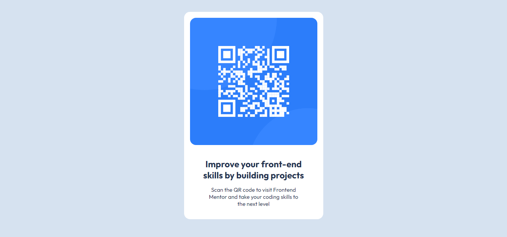

## Table of contents

- [Overview](#overview)
  - [Screenshot](#screenshot)
  - [Links](#links)
- [My process](#my-process)
  - [Built with](#built-with)
  - [What I learned](#what-i-learned)
  - [Continued development](#continued-development)
  - [Useful resources](#useful-resources)
- [Author](#author)
- [Acknowledgments](#acknowledgments)

## Overview

This project is to build out a QR code component and get it to look as close as the original figma design.

### Screenshot

### Links

Solution URL: (https://www.frontendmentor.io/solutions/qr-code-component-using-css-flexbox-lDQQ7BewT1)
Live Site URL: (https://qrcodesolutions.netlify.app/)

## My process

I started the project by understanding the several sections in the design. I also developed a plan to segment the design and accord appropriate classes and id to each section where necessary. Then, I started the development phase. 

### Built with

- Semantic HTML5 markup
- CSS custom properties
- Flexbox

### What I learned

The first thing I learnt was that practice make perfect. Knowledge can only be solidify through practicing the things you know.

### Continued development

In my future project, I would like to work on projects using the best practices in development. 

## Author

- Website - [Fatahi Showunmi](https://dev.to/virtuosofatahi)
- Frontend Mentor - [@Virtuoso-fatahi](https://www.frontendmentor.io/profile/Virtuoso-fatahi)

## Acknowledgments

I sincerely appreciate frontedmentor for this opportunity to practice our skills and become a better developer.
